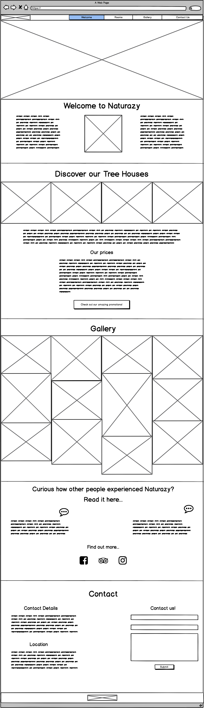
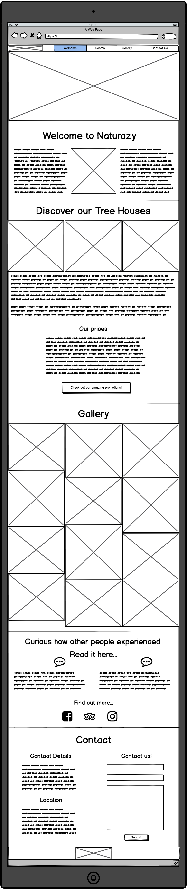
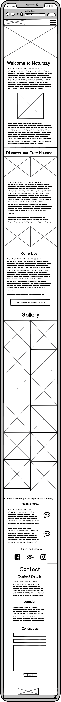

# **Naturazy**
## **Description** 
The goal for this project is to create an appealing website for Naturazy, a bed & breakfast in the middle of the nature. 
The target audience is couples of all ages who want to go on a getaway, away from their busy (city) lives, in order to relax in the nature. 
The site needs to be visually appealing so potential guests feel the need to go there in order to unwind. 
An intuitive user experience is key here so that the visitors find all the necessary information easily. 

This project is part of my course to become a Full Stack Developer. 
This will be my first project for which I will use HTML & CSS in order to create a static, responsive website. 

---

## Table of contents 
* [UX](#ux)
    * [User Goals](#user-goals)
    * [User Stories](#user-stories)
    * [Site Owners Goals](#site-owners-goals)
    * [User Requirements and Expectations](#user-requirements-and-expectations)
        * [Requirements](#requirements)
        * [Expectations](#expectations)
    * [Design Choices](#design-choices)
        * [Fonts](#fonts)
        * [Icons](#icons)
        * [Colors](#colors)
        * [Structure](#structure)
* [Wireframes](#wireframes)
* [Features](#features)
    * [Existing Features](#existing-features)
    * [Features to be implemented](#features-to-be-implemented)
* [Technologies used](#technologies-used)
    * [Languages](#languages)
    * [Tools and Libraries](#tools-and-libraries)
* [Testing](#testing)
* [Deployment](#deployment)
* [Credits](#credits)

## **UX**

### **User Goals**

* A website filled with valuable content
* Website should be easy to use on desktop, tablet & mobile
* Appealing visual elements
* Personal info about property & owners
* Website with creative call-to-actions
* Offer social proof like testimonials & guest reviews
* Contact details should be easy to find
* Form to contact owners directly from site

[Back to Top](#table-of-contents)

### **User Stories**
1. As a user I want that the website of a potential b&b to speak to my emotions right away.
I need to have the feeling that I don't want to miss out on the amazing experience. 
Pictures are for me the most convincing. I expect to see pictures of the rooms, property in general but also of the environment.
I would also like to have the possibility to get in touch with the property through the website. 

1. When I'm looking for my next holiday, I want the website to be easy to navigate. 
I also like to know a bit of information about the owners as a b&b experience is much more personal than going to a hotel. 
After reading about the propery and the owners, I want clear information about when I can do the check-in, check-out and the costs for breakfast and parking. 

1. When I choose a place to spend my valuable free time, I let myself be guided by experiences of others. Testimonials and guest reviews are the most important for me.
This in combination with appealing images really thrives my decision-making process. Links to social media like facebook, tripadvisor etc are key.

1. As an older person who is not the best with technology, it is very important that the website is easy and simple to use. I have just learned how to use a tablet so it's important that the website functions well on tablets.
The more intuitive the website is, the more likely I will be to book the property. I like to make a reservation directly with the property so I don't want to have to look too long in order to find the contact details of the property.

### **Site owners Goals**
* Advertise Bed & Breakfast and all its features
* Increase bookings
* Stand out from the competition

[Back to Top](#table-of-contents)

### **User Requirements and Expectations**

#### Requirements
* Easy to navigate by using the navigation menu
* Relevant content about the property
* Appealing visual elements
* Easy way to contact propery
* Clear information about how to make a booking

#### Expectations
* When clicking on links (like social media), I expect the page to open in a seperate browser
* I expect feedback when submitting the contact form that the form has been submitted correctly
* I expect that the navigations works properly so that is takes me wherever I want to go
* Clear info about location 
* Website is in line with the customer's journey

[Back to Top](#table-of-contents)

### **Design Choices**
As the property is located in the middle of the nature, I made all my design choices based on natural colors & elements.
I have used [Coolors](https://coolors.co/ "Coolors.co") and [Color Hunt](https://colorhunt.co/) to come up with a color scheme that fits the overall feeling of nature.

#### Fonts
In order to find appropriate fonts for my website, I have visited [Google Fonts](https://fonts.google.com/ "Google Fonts") to explore the various options.
For the overall content I have decided to use the [Fanwood Text](https://fonts.google.com/specimen/Fanwood+Text?query=fanw "Google fonts: Fanwood Text") font. In my opinion this font is easy to read and visually appealing.
For my headings I decided to go with a different font in order to make them stand out from the main content. The font I chose for this, is the [Eagle Lake](https://fonts.google.com/specimen/Eagle+Lake?query=eagle "Google Fonts: Eagle Lake") font.
This is a calligraphic font that highlights to heading and gives it a more personal feeling. 

#### Icons
I have decided to implement icons, using the [Font Awesome library](https://fontawesome.com/ "Font Awesome"). The icons that I chose are self explanatory and are in line with the overall feeling of the website.
I will make sure that the icons are styled according to the website. I will use the icons mainly in the navigation bar in order to make it more appealing. The navigation icons will disappear when viewing on a mobile in order to keep it clear.
The navigation menu will transform into a hamburger icon to make it more simple to use on mobile.

#### Colors
As mentioned before, I based my color scheme on the natural aspect of the property. 
You can view my color scheme [here](https://colorhunt.co/palette/193637).
Below I will explain more why I choose the various colors and for what I will be using them.

* #3C5D4B: This color will be used as my primary background-color. It is a dark green color (referring to trees, plants) which creates a calm, natural feeling. 
* #A1BAAF: This color is a slightly ligher green which I will use for my navigation menu and call-to-action buttons.
* #F6FFF8: This color will be used as text color for the overall contact of the page. It's a mint cream (off white) which stands out well to the background colors that I have chosen.
* #39210C: This is a seal brown color which represents the wood in nature. I will use this color as text-color for my navigation & buttons. 

I have used to contract checker on Coolors in order to make sure that the contract is sufficient.
This way my content will be easily readable. 

#### Structure
I have chosen to use [Bootstrap4](https://getbootstrap.com/) to create an overall structure for my website. 
Bootstrap provides various elements of CSS and Javascript which is very helpful to keep a good structure on your page. 
As Bootstrap4 is designed for mobile first, I will be certain that my website functions well on mobile.

[Back to Top](#table-of-contents)

--- 

## **Wireframes**
I have decided to use [Balsamic](https://balsamiq.com/wireframes/) to create wireframes for my website. 
First I created a basic wireframe for desktop and later on for tablet and mobile. 
For my website I have decided to go for a 1 page website which suits more with the current trends. 
The website will be easy to navigate by using the navigation bar or by scrolling down the page. 

You can find my wireframes below:

### Desktop Wireframe

### Tablet Wireframe

### Mobile Wireframe

[Back to Top](#table-of-contents)

---

## **Features**

### **Existing Features**

#### Navigation
For the navbar I have used Boostrap to create a responsive navbar. 
I have implemented as well the hamburger icon for mobile devices to be more user-friendly. 
In order to navigate more easilty through the site, I have implemented to scroll spy option from bootstrap to let the user exactly know where they are located on the site. 
For this to work properly I have fixed the navbar on the top of the page.

#### Hero Image

I have decided to implement a hero image which spreads over 100% of the screen. In order to make the user curious about what follows next, I decided to set the height at 80vh so show a little peek of what comes next.
The image responds well when viewing on desktop, tablet and mobile.

#### Welcome Section

Here I used the grid from Bootstrap to create 3 colums on desktop view which turn into full width on mobile devices. 

#### Tree Houses Section

Here I also worked with the grid which was a bit more challenging. I implement 4 pictures who show all next to each other on desktop. 
On Tablet I have decided to hide 1 picture and on mobile I decided to hide 2 of the pictures and only show them after the introduction text of the tree houses.
In order to accomplish this, I used display: none and display: block when creating the columns. 

For the price section, I have a used a responsive pricing table instead of the normal table in bootstrap. 
I have worked with icons here to really show the difference between the 3 pricing models. 

Under the pricing model I have inserted a button which opens a modal with the current promotions. 

#### Gallery

For the gallery I have created a class which contains all the settings for position, size and height. 
Every image also got an ID where I added the background-image and in some cases I overwrote the position to be more appealing. 

#### Testimonials

Here I also worked with the grid from bootstrap and as well some icons to make the section more visually appealing. 
Under the testimonials I have added the links to social media using icons which opens in a separate tab in the browers. 
This to make the website more user friendly.

#### Contact 
At the contact section I have provided contact and location details on the left. 
On the right I implemented a form which they can fill in if they would like to get in contact with the owners. 
Below the form there is a submit button which also triggers a modal to open up which gives feedback to the user that the form has been successfully submitted.

### **Features to be implemented**

* Interactive map for location with a link to google maps
* Direct booking module to increase direct bookings
* Form validation to make sure that the form can not be submitted when the fields are not filled in. The modal should only appear whenever all the fields were correctly filled in
* Chat bot that links with the whatsapp of the property
* Links to external partners / companies like restaurants, activities in the neighbourhood, hike trails etc.
* Include information on how their data will be used (GDPR-Law)

[Back to Top](#table-of-contents)

## **Technologies used**

### **Languages**

#### HTML

I have used HTML to write the main content of my website and to give the overall lay out.

#### CSS

I have used CSS to style the elements on the website and used it to overwrite the basic styling from bootstrap.

#### JavaScript

I have implemented some basic JavaScript features from Bootstrap. This to create 2 modals and the hamburger icon for the navigation bar on mobile devices.

### **Tools and Libraries**

#### Font Awesome

I used this library to obtain icons for social media, pricing model and testimonials. 

#### Bootstrap

I have used the library of Bootstrap to provide an overall lay out of my website using the grid. 
I also implemented other components like the navbar, pricing model, modals to style individual sections on my website. 

#### Google Fonts

I browsed the library of google fonts in order to obtain appealing fonts for the website.

#### Git

I have used GitPod to write and style my code. 
I have used the following commands in the terminal to make sure my code was saved properly:
* git add
* git commit -m ""
* git push

#### Balsamiq

I have used Balsamiq to make my wireframes for desktop, tablet and mobile.

#### W3C HTML Validation Service
This site was used to check the HTML code in the project.

#### W3C CSS Validation Service
This site was used to check the CSS code in the project.

[Back to Top](#table-of-contents)

## **Testing**

* Navbar:
All the links in the navigation bar works properly. Also the scrollspy works properly and underlines the correct link wherever you are on the page. 
This by implementing the data offset. The navbar also converts nicely into the hamburger sign with the dropdown menu on mobile devices.

* Various sections: 
All the sections work as intended and display nicely on desktop, tablet and mobile. 

* Modals 
The modals are triggered by clicking the 2 different buttons and show correctly over the navbar by setting the Z-index.

* Contact Form 
The contact form works properly but like mentioned before, I would like to implement the form validation in order for the input to be valid before being able to submit the form.
At this time, I don't have the skills yet to implement this but this is definitely a feature to be implemented in the future. 

* Links
All the links to social media like facebook, instagram and tripadvisor work correctly and open in a new tab like planned. 
This links take you to the general website and not to a specific page as they don't exist. This would be updated when the property would exist.

* Footer 
I implement the brand again in the footer which takes you again to the top of the page when clicking on it. 

### Bugs

#### Mobile
* The hero image doesn't show nicely due to the picture not being of high resolution
* The icons for social media don't appear next to each other. The icon for instagram shows below. 

[Back to Top](#table-of-contents)

## **Deployment**

This project was deployed via GitHub by executing the following steps.
After writing the code, committing and pushing it to GitHub:

1. Navigate to the repository on github and click Settings.
1. From there, go to the Source section within the Github Pages section.
1. Select master branch on the dropdown menu, and click save.
1. Now the website is live on https://anouksmet.github.io/Naturazy/ 
1. Any time commits and pushes are sent to Github, the Github Pages site should update shortly after.

To run the project locally:

1. Click the green Clone or Download button on the Github Repository
1. Using the Clone with HTTPS option, copy the link displayed.
1. Open your IDE, and ensure the Git Terminal is open.
1. Change the working directory to the location where the cloned directory is to go.
1. Use the "git clone" command and paste the url copied in the second step.

[Back to Top](#table-of-contents)

## **Credits**

### Content - Media - Inspiration

I have used the following websites to gather ideas and information for the overall content of my website: 

https://hermanncottage.com/

https://www.treehousepoint.com/

https://www.quirkyaccom.com/treehouse-holidays

From the first 2 website I have also used most of the images for my website. 

I have used https://unsplash.com/ for my hero image and the picture of the owners.

### Acknowledgements

First of all, I would like to thank my mentor Simen (Eventyret_mentor) for guiding me throughout this project. 
He helped me to brainstorm about ideas which were in line with my interests. 
During the mid review, he gave me a lot of tips in order to improve my code and to implement some other features in order to make my website more user friendly. 

I would also like to thank my partner Artur and my parents to provide honest feedback about the website and to put themselves in the shoes of the users.

My inspiration I got mostly from runnning a bed & breakfast myself in Portugal a couple of years ago. 
This experience gave me some good insights of what owners expect from their website. 
As one of my passions is travelling, I also managed to put myself in the shoes of a potential guests. 

[Back to Top](#table-of-contents)